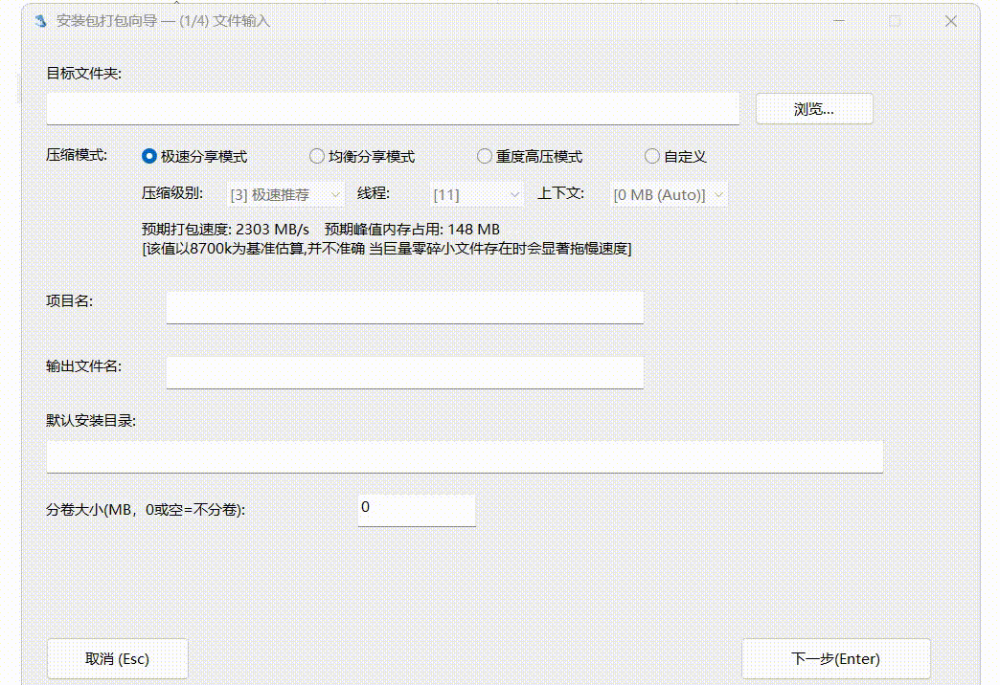

# Dolphi

support EN CN JP RU

**高效的 Windows 压缩与分发工具**

Dolphi 是一款基于 **Zstandard (Zstd)** 算法的轻量级 Windows 压缩与分发工具。

与仅追求极限压缩率的传统解压软件不同，Dolphi 更专注于现代文件交付的完整工作流。无论是日常文件的高速打包提取，还是专业软件的独立分发与部署，Dolphi 都能为您提供更流畅、高效的体验。

[简体中文](#简体中文) | [English](#english)

  
  

---

# 🇨🇳 简体中文

> **Beta 版本提示**
> Dolphi 目前处于 Beta 测试阶段。核心功能与 Windows 环境适配（如文件占用、权限、路径处理等）已完成初步测试。由于本工具涉及底层文件的压缩、释放及系统级别的安装卸载，在处理极为重要的数据前，建议您做好文件备份。欢迎在遇到问题时向我们提交 Issue。

Dolphi 让文件分享像运行软件一样简单：一个小程序（128KB），双击即可使用。

### 核心特性

**基于 Zstd 的高速压缩引擎**
Dolphi 采用现代压缩算法 Zstandard 作为核心。它在压缩速度、解压速度与压缩率之间取得了极佳的平衡，非常适合用于处理现代庞大的软件发布包、游戏资源、更新补丁及大型文件传输。

**便捷的自释放分发 (SFX)**
只需一次打包，即可生成独立运行的自释放程序。接收者无需安装 Dolphi 或任何第三方解压软件，双击运行即可自动将文件释放至当前目录，实现真正的“即开即用”。特别适合便携版软件、游戏 MOD 及日常文件的快速分享。

**标准 Windows 安装包构建**
对于有正式发布需求的开发者，Dolphi 提供了完整的 Windows 安装程序构建功能。打包者可以预设安装目录、配置注册表项并集成卸载管理，轻松打造专业、规范的软件部署流程。

**广泛的 ZIP 格式兼容**
在提供专属分发能力的同时，Dolphi 依然支持输出标准的 ZIP 格式压缩包。当您需要与 macOS、Linux 用户进行文件交换，或需要兼容第三方解压工具时，ZIP 格式能确保文件畅通无阻。

**灵活的分卷压缩**
面对超大文件或网盘上传体积限制，Dolphi 支持将大型压缩文件分割为多个分卷，让大文件的管理、传输和发布变得更加从容。

**面向自动化的脚本打包**
Dolphi 支持通过 INI 配置文件进行命令行级别的自动化打包。该功能专为构建阶段设计，非常适合无缝接入 CI/CD 工作流、执行批量打包任务以及自动化测试发布（注：此功能用于打包过程自动化，而非客户端的静默安装）。

**坚固的现代加密保护**
针对现代分发场景的安全需求，Dolphi 采用了高强度的加密设计。它显著提高了密码验证的计算成本，有效抵御离线暴力破解攻击，为您的私有资源、商业分发文件及内部测试版本保驾护航。

**深度的 Windows 资源管理器集成**
安装后，Dolphi 将完美融入 Windows 右键菜单。无需繁琐地打开主界面，右键点击即可完成常用的压缩与打包操作。全面兼容 Windows 7、Windows 10 及 Windows 11，并支持简中、英文、日语及俄语多种界面语言。

### 适用场景

*   **日常用户：** 追求高效的文件打包、备份与快捷分享。
*   **开发者与工作室：** 制作 Windows 软件安装包、发布便携版程序及分发游戏资产。
*   **开源项目维护者：** 自动化构建 GitHub Releases，简化 Windows 用户的下载与使用门槛。

### 下载与支持

*   **最新版本下载：** [GitHub Releases](https://github.com/pkmnya/dolphi/releases/latest)
*   **交流反馈（QQ群）：** [点击加入](https://qm.qq.com/q/wdYINMkdIA)

# 🧩 为什么选择 Zstandard (Zstd)
## Zstd 简介：速度与体积的高效平衡
如果您不了解 Zstd，可以简单将其理解为：相比于追求极限压缩率的传统算法，Zstd 更注重现代文件分发中的**速度体验**。其核心设计目标是在压缩速度、文件体积和释放（解压）速度之间取得最高效的平衡。
根据 Zstandard 官方基准测试，Zstd 具备极高的解压吞吐能力：
 * 单核心解压速度可达到接近 **1GB/s 级别**。
 * 低压缩等级下可提供极高的压缩处理速度，非常适合快速生成发布包。
因此，Zstd 特别适合：软件发布、游戏资源分发、更新补丁、大型文件分享以及个人用户的大型数据备份与快速恢复。
## Dolphi 场景实测对比
在 Dolphi 的实际测试场景中（约 2GB 数据，包含约 2000 个零碎文件），我们采用了高速压缩模式进行对比：
 * **传统高压缩率算法**：即便调整至最低压缩等级和最高速度参数，仍需约 **20 秒**完成压缩。
 * **Zstd（Level 3 高速模式）**：仅需约 **5 秒**即可完成。
 * **代价**：压缩后的文件体积从约 1.2GB 增加至约 1.35GB。
**结论：增加约 10%～15% 的文件体积，可以换取约 4 倍的打包速度提升。**
## 核心优势与适用场景
Zstd 的优势大小取决于您的核心目标：
 1. **高速分发与备份**：在低压缩等级下，Zstd 处理速度极快，是快速生成发布包、日常文件传输和备份的理想选择。
 2. **解压体验至上**：Zstd 的核心杀手锏在于释放阶段。即使在较高压缩等级下，它依然能保持极高的解压效率，这对于减少接收者等待时间至关重要。
 3. **劣势提醒**：如果在相同（极小）压缩体积的要求下，Zstd 的压缩速度通常会处于极大劣势；若只追求极限小体积（如大型企业长期归档、降低海量分发成本），传统高压缩率算法经过长期优化，依然占据绝对优势。
## 为什么 Dolphi 选择 Zstd？
大型企业发行和长期归档可能在意极限压缩率，但 Dolphi 面向的是另一类实际需求群体：
 * 第三方游戏与软件打包者
 * 独立开发者
 * 资源分享者
 * 需要频繁制作和传输文件的个人用户
这些用户通常通过网盘、聊天工具或临时分享方式传播文件。对他们而言，用少量的体积增加换取全流程的提速，往往是更合理的选择：
 * **更快打包**：减少发布者的等待时间。
 * **更快上传分享**：提升分发效率。
 * **更快释放**：让接收者能以最快速度开始使用。
如果您感兴趣，可以尝试用 20GB 的数据进行实际对比。您可能会发现：压缩过程只是开始，真正影响用户体验的往往是最后的释放速度。
Dolphi 选择 Zstd，不是为了制造“最小的压缩包”，而是为了优化完整的数据交付流程：
**更快打包，更快备份，更快释放，更快开始使用。**

---

# 🇬🇧 English

> **Beta Warning**
> Dolphi is currently in its Beta stage. While core features and Windows compatibility (including file handling, permissions, and path processing) have been tested, the tool performs fundamental file operations like extraction, installation, and uninstallation. Please ensure you back up important data before use.

Dolphi lets you send files like an application: one small executable（128KB）, double-click, ready to use.

### Core Features

**High-Speed Zstandard Engine**
Powered by the modern **Zstandard (Zstd)** algorithm, Dolphi moves away from the traditional obsession with extreme compression ratios. Instead, it offers an optimal balance between compression speed, extraction speed, and file size, making it ideal for modern software packages, game assets, and large file transfers.

**Standalone Self-Extracting Packages (SFX)**
Dolphi allows you to create independent self-extracting archives. Your recipients do not need Dolphi or any other extraction utility installed on their system. Upon execution, the package automatically extracts its contents directly into the current directory, perfect for portable applications, quick tools, and hassle-free file sharing.

**Professional Windows Installer Generation**
For software distribution, Dolphi features an installer mode that creates standard Windows setup executables. Developers can easily define target directories, configure registry entries, and manage uninstallation routines to deliver a complete and professional deployment experience.

**Standard ZIP Compatibility**
While Dolphi excels in Windows-specific distribution, it retains full support for creating standard ZIP archives. This ensures seamless cross-platform compatibility when sharing files with macOS or Linux users, or when working with third-party archive utilities.

**Multi-Volume Archives**
Easily bypass upload limits and simplify the transfer of massive files. Dolphi supports splitting large archives into smaller, manageable volumes, making it highly suitable for game resource distribution and large package delivery.

**Scriptable Automated Packaging**
Designed with developers in mind, Dolphi supports automated package creation via INI configuration files. This is engineered specifically to integrate into CI/CD pipelines for batch packaging and reproducible builds (Note: This automates the *creation* of packages, not the silent installation process on the user's end).

**Modern Encryption Protection**
Security matters. Dolphi implements modern encryption designed specifically to protect distributed content. By intentionally increasing the computational cost of password verification, it significantly improves resistance against offline brute-force attacks, keeping your private resources and commercial files secure.

**Seamless Windows Explorer Integration**
Dolphi integrates directly into the Windows context menu. You can perform standard packing and archiving tasks with a simple right-click, without needing to open the main application interface. It is fully compatible with Windows 7, 10, and 11, and supports English, Simplified Chinese, Japanese, and Russian.

### Use Cases

*   **Everyday Users:** Fast and reliable file packing, backups, and sharing.
*   **Developers & Studios:** Creating Windows releases, professional installers, portable apps, and game resource packages.
*   **Open Source Maintainers:** Streamlining GitHub Releases and automated builds for an improved user experience on Windows.

### Download

*   **Latest Release:** [GitHub Releases](https://github.com/pkmnya/dolphi/releases/latest)

# 🧩 Why We Chose Zstandard (Zstd)
## Introduction: An Efficient Balance of Speed and Size
If you are unfamiliar with Zstd, you can simply understand it this way: while traditional compression algorithms often prioritize minimizing file size, Zstd focuses on the **speed experience** in modern file distribution. Its core design goal is to achieve an efficient balance among compression speed, file size, and decompression speed.
According to official Zstandard benchmarks, Zstd boasts exceptionally high decompression throughput:
 * Single-core decompression speeds can reach nearly **1GB/s**.
 * Lower compression levels provide extremely fast processing speeds, making it ideal for quickly generating release packages.
Therefore, Zstd is particularly suited for: software releases, game resource distribution, update patches, large file sharing, and large-scale data backup & rapid recovery for individual users.
## Real-World Testing with Dolphi
In Dolphi's practical test scenarios (using approx. 2GB of data containing about 2,000 fragmented files), we compared high-speed compression modes:
 * **Traditional high-compression algorithms:** Even when tuned to lower compression levels and maximum speed parameters, they still required about **20 seconds** to complete.
 * **Zstd (Level 3 High-Speed Mode):** Completed the task in just about **5 seconds**.
 * **The Trade-off:** The compressed file size increased from roughly 1.2GB to 1.35GB.
**The takeaway: A 10% to 15% increase in file size can yield an approximate 4x improvement in packaging speed.**
## Core Advantages and Trade-offs
The benefits of Zstd depend heavily on your specific goals:
 1. **High-Speed Distribution and Backup:** At lower compression levels, Zstd offers incredibly high processing speeds, making it perfect for rapid package generation, routine file transfers, and backups.
 2. **Superior Decompression Experience:** Zstd's true core advantage lies in the extraction phase. Even at higher compression levels, it maintains excellent decompression efficiency, which is crucial for minimizing the end-user's wait time.
 3. **Limitations:** If the goal is to reach the extremely small file sizes of traditional algorithms, Zstd requires higher compression levels and more computational resources, putting its compression speed at a severe disadvantage. For long-term archiving or enterprise-scale distribution where absolute minimum size is critical, traditional high-compression algorithms still dominate.
## Why Dolphi Chose Zstd
While large enterprises might focus on extreme compression ratios to cut massive storage and distribution costs, Dolphi targets a different set of practical needs:
 * Third-party game and software packagers
 * Independent developers
 * Resource sharers
 * Individual users who frequently create and transfer files
These users typically distribute files via cloud drives, chat apps, or temporary sharing links. For them, trading a small increase in file size for an overall speedup across the entire workflow is a much more reasonable choice:
 * **Faster packaging:** Reduces wait times for publishers.
 * **Faster uploading and sharing:** Improves distribution efficiency.
 * **Faster extraction:** Allows recipients to start using the files almost immediately.
If you're curious, try running a real-world comparison with 20GB of data. You might realize that the compression process is just the beginning—it's the final decompression speed that truly dictates the user experience.
Dolphi chose Zstd not to create the "smallest possible archive," but to optimize the entire data delivery pipeline:
**Faster packaging, faster backups, faster extraction, faster usage.**

