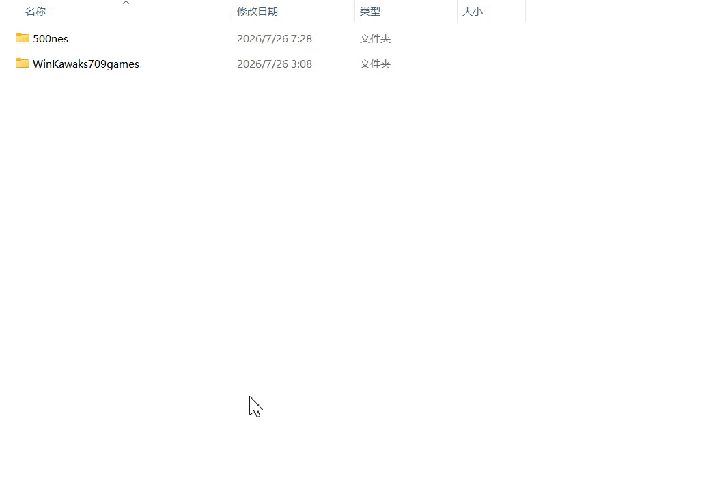

# Dolphi - Zstd Windows Compression Tool 

[简体中文](#简体中文) | [English](#english)

  <h3>Quick Mode Demo [支持分卷压缩 / Multi-volume Archive Support]</h3>
  

 

  <h3>Install Mode Demo [支持四种语言 / 4 Languages Supported]</h3>
  <!-- 为视频添加了自动播放、循环播放和移动端内联播放属性 -->
  <video src="https://raw.githubusercontent.com/pkmnya/main/demo_install.mp4" controls="controls" autoplay="autoplay" loop="loop" muted="muted" playsinline="playsinline" width="50%"></video>

---

## 🇨🇳 简体中文

⚠️ **Beta 版本警告：**  
*本软件目前处于 **Beta（测试）** 阶段，可能存在部分较为严重的 Bug（软件缺陷）。请谨慎使用，切勿在未备份的情况下用于处理重要数据。*

### 📝 项目简介
**Dolphi** 是一个简单易用、轻量且极速的 Windows 压缩工具，底层采用高效的 **Zstandard (Zstd)** 压缩算法。

### ✨ 主要功能
*   **安装包打包向导：** 运行 `dolphi` 主程序后将直接进入打包向导，支持将您的文件打包成带有注册表写入和卸载功能的完整安装包。
*   **右键快捷压缩：** 软件安装后，会自动集成到 Windows 操作系统 (Operating System) 的右键菜单，提供便捷的快捷压缩功能。
*   **一键便携操作：** 支持独立、便携式的一键压缩与一键解压功能。
*   **高性能：** 采用 Zstandard (Zstd) 算法，在压缩率与速度之间取得绝佳平衡。
*   **多语言支持：** 🇨🇳 简体中文 | 🇺🇸 英语 | 🇯🇵 日语 | 🇷🇺 俄语。

### 💻 兼容性
*   **系统支持：** 目前已在 Windows 7 Latest (United States) 与 Windows 11 (China) 上完成了基础功能的全路径测试 (Full-path Testing) 并顺利通过。

### 🤖 开发方式
本项目深度使用了 **Gemini** 进行辅助编程，采用 **Vibecoding** 方式完成构建。

### 📥 下载安装
👉 **[点击此处前往 Release 下载最新版本](https://github.com/pkmnya/dolphi/releases/latest)**

**[QQ群](https://qm.qq.com/q/wdYINMkdIA)**

---

## 🇬🇧 English

⚠️ **Beta Version Warning:**  
*This software is currently in the **Beta** stage. It may contain severe bugs. Please use it with caution and do not use it to process critical data without making backups first.*

### 📝 Introduction
**Dolphi** is a simple, easy-to-use, and lightning-fast Windows compression utility powered by the highly efficient **Zstandard (Zstd)** algorithm. 

### ✨ Features
*   **Installer Packaging Wizard:** Running the main `dolphi` executable opens the packaging wizard, allowing you to easily pack files into standalone installers complete with registry integration and uninstaller capabilities.
*   **Context Menu Integration:** Once installed, Dolphi adds a convenient "quick compression" feature directly to your Windows context menu.
*   **One-click Portable Operation:** Supports intuitive, portable one-click compression and one-click decompression.
*   **High Performance:** Built on the Zstandard (Zstd) algorithm, offering an excellent balance between compression speed and ratio.
*   **Multilingual Support:** 🇺🇸 English | 🇨🇳 Simplified Chinese | 🇯🇵 Japanese | 🇷🇺 Russian.

### 💻 Compatibility
*   **OS Support:** Basic functional full-path testing has been successfully completed and passed on Windows 7 Latest (US) and Windows 11 (CN).

### 🤖 Development Method
This project deeply utilized **Gemini** for programming assistance and was built using the **Vibecoding** approach.

### 📥 Download
👉 **[Download the Latest Release Here](https://github.com/pkmnya/dolphi/releases/latest)**
